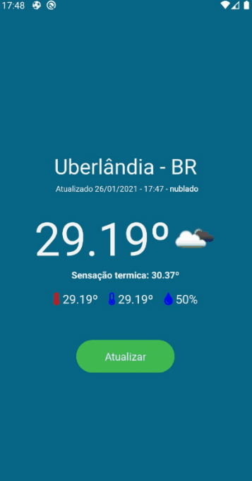

<h1 align="center">
   WeatherNow
</h1>

<h1 align="center">
   App - clima agora
</h1>

<p align="center">
  
  

  <a href="https://www.linkedin.com/in/charlespereira1/" target="_blank" rel="noopener noreferrer">
    
  </a>

  

  <a href="https://github.com/CharlesPereira1/weathernow/commits/">
    
  </a>
</p>

<!-- <p align="center"> -->

&nbsp;&nbsp;&nbsp;&nbsp;&nbsp;&nbsp;&nbsp;&nbsp;&nbsp;&nbsp;&nbsp;&nbsp;&nbsp;&nbsp;&nbsp;&nbsp;&nbsp;&nbsp;&nbsp;&nbsp;&nbsp;&nbsp;&nbsp;&nbsp;&nbsp;&nbsp;&nbsp;&nbsp;&nbsp;&nbsp;&nbsp;&nbsp;&nbsp;&nbsp;&nbsp;&nbsp;&nbsp;&nbsp;&nbsp;
&nbsp;&nbsp;&nbsp;&nbsp;&nbsp;&nbsp;&nbsp;&nbsp;&nbsp;&nbsp; [Sobre o projeto](#about)&nbsp;&nbsp;&nbsp;|&nbsp;&nbsp;
[Tecnologias](#tech)&nbsp;&nbsp;&nbsp;|&nbsp;&nbsp;
[Iniciando o projeto](#project)&nbsp;&nbsp;&nbsp;

<!-- </p> -->

</br>

<p align="center">
  
</p>

## ☀️ <a name="about"></a>Sobre o projeto

Este projeto foi desenvolvido em react native com typescript com a intenção de trazer para o usuário dados climaticos em tempo real de acordo com a sua localidade **(longitude e latitude)**.

Usando o aplicativo móvel:

- Inicie o aplicativo;
- Se o gps não estiver ligado o aplicativo irá pedir permissão para acessa-lo se for pelo **android**. Esta permissão para **ios** já vem por padrão habilitada. Nos demais acessos o app irá trazer;
- Assim que for liberado permissão o app já traz o clima em tempo real de acordo com o endereço de localização;
- Para atualizar o clima, basta clicar no botão **atualizar**;

Api utilizada: [OpenWeatherMap](http://api.openweathermap.org/)<br />

## ☁️ <a name="tech"></a>Tecnologias

Tecnologias usadas no desenvolvimento do aplicativo

- ✔️[ReactJS](https://reactjs.org/)
- ✔️[React Native](https://reactnative.dev/)
- ✔️[TypeScript](https://reactnative.dev/docs/typescript)
- ✔️[Context API](https://pt-br.reactjs.org/docs/context.html)
- ✔️[Axios](https://github.com/axios/axios)
- ✔️[React Hooks](https://pt-br.reactjs.org/docs/hooks-intro.html)
- ✔️[Date-fns](https://date-fns.org/)
- ✔️[React Native Vector Icons](https://github.com/oblador/react-native-vector-icons)
- ✔️[Styled Components](https://styled-components.com/)
- ✔️[Eslint](https://eslint.org/)
- ✔️[Prettier](https://prettier.io/)
- ✔️[EditorConfig](https://editorconfig.org/)
- ✔️[React Native Splash Screen](https://github.com/crazycodeboy/react-native-splash-screen/)
- ✔️[React Native Dotenv](https://www.npmjs.com/package/react-native-dotenv)

## ❄️ <a name="project"></a>Iniciando o projeto

### Requerimentos

- Acessar este projeto [WeatherNow](https://github.com/CharlesPereira1/weathernow/tree/master/mobile)

**Clone o projeto e acesse a pasta**

```bash
# No terminal execute o seguinte comando
$ git clone https://github.com/charlespereira1/weathernow.git

# Logo após fazer o clone com o terminal aberto adicionar o seguinte comando
cd weathernow/mobile
```

**Passo para configurar o arquivo .env**

Para começar é nessesário acessar o site da openweathermap, logar com email e senha e acessar o link para copiar o key.

- Capturar key [Key Weathernow](https://home.openweathermap.org/api_keys)

```bash
# Com o projeto aberto no vscode crie um arquivo .env e adione a url de acesso e a chave key
# Para mais detalhes existe o arquivo .env.example para se baseiar. Siga o modelo de acordo com o exemplo e informe os valores
API_BASE=http://api.openweathermap.org

API_KEY=
```

**Siga os passos abaixo - via terminal do vscode**

```bash
# Instalar dependências
$ yarn

# Com o terminar aberto acesse a pasta ios
cd ios

# Execute o comando a seguir para instalar as dependências de forma nativa no ios
$ pod install

# Volte para a pasta mobile
cd..

# Se você for emular com o Android, execute este comando
# Certifique-se de ter o emulador aberto
$ yarn android

# Se você for emular com ios, execute este comando
$ yarn ios

# Caso você tenha efetuado os processos acima e o terminal node não abriu.
# Mantenha o emulador aberto, vá no terminal e execute este comando
$ yarn start
```

**Siga os passos abaixo para executar o app em dispositivo físico**

```bash
# Se for executar o aplicativo emulando no próprio dispositivo execute estes comandos.
# Obs tenha ctz que o dispositivo esteja em modo desenvolvedor e que seja permitido a instalação de Apps.

# Execute o comando para verificar se seu disposito está conectado ao windows
$ adb devices

# Execute o comando para execute o Metro Bundler via terminal
$ yarn start

# Em seguida abra outra aba do terminal e abra o app via dispositivo com o seguinte comando:

# Para android
$ yarn android

# Para ios
$ yarn ios
```

**Observação importante para execução em Android**

```bash
# Caso o projeto no momento da execução dê erro de assinatura, acesse o seguinte caminho abaixo, e em seguida exclua o arquivo `signing-config.json`:

"android\app\build\intermediates\signing_config\debug\out"

# Após exclusão refaça novamente o processo de execuçãoes padrões via terminal:

$ yarn android

```

---

Feito por Charles Pereira 👋 &nbsp;[linkedin](https://www.linkedin.com/in/charlespereira1/) | [Github](https://github.com/CharlesPereira1)
